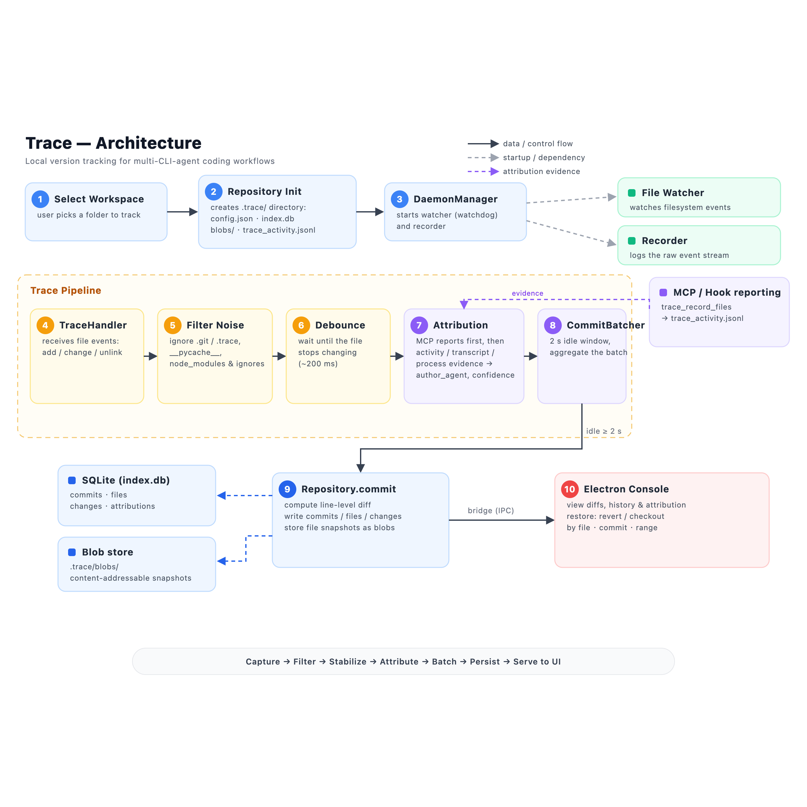

# Trace

> **中文** · [English](README.en.md)

Trace 是一个面向 AI 编程协作场景的本地版本追踪工具。它不替代 Git，而是补充 Git：当你同时使用 Claude Code、Codex CLI、Cursor、OpenCode 等工具修改同一个项目时，Trace 会在后台记录“哪个 agent 在什么时候改了哪些文件”，并把每次变化保存成可以查看 diff、回退文件、撤销某个 agent 修改的本地快照。

Trace 的核心目标是解决多 agent 协作时的三个问题：

- **看得清来源**：区分人类手动修改、Claude、Codex、Cursor 等不同来源的文件变化。
- **找得到过程**：把短时间内连续发生的文件变化合并成一次版本记录，方便回看每一步。
- **能安全恢复**：在 Electron 操作台里查看 diff，并把单个文件或某次修改恢复到之前的版本。

## 架构



捕获文件变化 → 过滤噪声 → 等待文件稳定 → 通过 MCP/活动/进程证据归因 → 批量提交 → 持久化到 SQLite 与内容寻址 blob → 通过桥接服务提供给 UI。

## 软件如何使用

### 1. 选择要追踪的工作区

启动 Trace 后，先选择一个需要追踪的项目文件夹，例如你的课程项目目录。Trace 会在该目录下创建 `.trace/` 文件夹，用来保存本地数据库和文件快照。

`.trace/` 是 Trace 自己的本地数据目录，不需要手动编辑；如果项目使用 Git，建议把 `.trace/` 加入 `.gitignore`。

### 2. 保持 Trace 在后台运行

Trace 启动后会在系统托盘或菜单栏常驻，并启动文件监听服务。之后你可以正常使用编辑器、终端或 AI 编程工具修改项目文件，Trace 会自动捕获创建、修改、删除和移动事件。

如果使用源码运行：

```bash
uv sync
uv run python code/main.py --workspace /path/to/your/project
```

如果已经使用打包版本：

- macOS：打开 `Trace.app`，选择工作区。
- Windows：运行 `Trace.exe`，选择工作区或使用已记录的上次工作区。

### 3. 配置 AI 工具的 MCP 申报

Trace 支持 MCP。配置后，Codex、Claude Code 等 agent 可以主动告诉 Trace“这次是我改的这些文件”，归因会比只靠进程扫描更准确。

最简单的方法是在 Electron 操作台中打开 **MCP** 页面，点击对应 agent 的“一键添加”按钮。配置完成后，重启对应的 AI 工具，让新的 MCP 配置生效。

### 4. 查看历史、diff 和归因

打开 Trace 的 Electron 操作台后，可以查看：

- 时间线：每次文件变化记录。
- Agents：不同 agent 的活动统计。
- Diff：某次提交中每个文件的具体变化。
- Workspace：当前工作区、数据库位置和快照数量。
- MCP：Codex、Claude Code 等工具的连接配置状态。

Trace 支持文本、Office 文档、PDF、图片和二进制文件的版本记录；其中常见文本和文档格式会显示更友好的 diff 摘要。

### 5. 恢复文件或撤销修改

在操作台中选择某次历史记录后，可以查看对应文件的 diff，并按需要执行恢复操作。常见用法包括：

- 把单个文件恢复到某个历史版本。
- 回退某个 agent 造成的一批修改。
- 在恢复前保留当前版本，避免误操作覆盖现有内容。

所有数据都保存在当前工作区的 `.trace/` 目录中，不会上传到云端，也不需要配置大模型 API Key。

## 项目概览

Trace 是一个多 CLI Agent 协作版本追踪器。它在后台监听工作区文件变化，识别当前活跃的 Claude Code、Codex CLI、Cursor、OpenClaw、OpenCode、Hermes 或 Kimi Code，把每一批变化按 agent 归属写入本地 SQLite，并用内容寻址 blob 保存文件版本。

## 核心能力

- 自动检测工作区内活跃的 CLI agent，并记录 `confidence`、`candidates`、`ambiguous` 等归属信息。
- 使用 watchdog 监听文件创建、修改、移动和删除事件。
- 对 `.git`、`.trace`、临时文件和重复事件做噪声过滤。
- 按 agent 独立 2 秒防抖，把连续变化合并成 commit。
- 使用 SHA-256 blob 存储任意文件类型。
- 使用全量 manifest commit 支持恢复到任意历史时间点。
- 支持文本、`.docx`、`.pptx`、`.xlsx`、`.pdf`、图片和未知二进制文件的差异展示。
- 提供 macOS/Windows 菜单栏与 Electron 操作台。
- 支持 `AgentActivityRecorder` 主动采样、GUI/Script 检测、ambiguous 修正、按 agent 选择性撤销和离线变化补偿。

## 快速开始

```bash
uv sync
bash scripts/demo.sh
```

启动完整菜单栏应用（默认会同时打开 Electron 操作台；`--headless` 仅跑守护进程、不弹 UI）：

```bash
uv run python code/main.py --workspace test_workspace
```

单独启动 Electron 操作台（开发调试）：

```bash
cd electron_app
npm install
npm start -- --workspace=../test_workspace
```

## Trace MCP 接口

Trace 提供一个本地 stdio MCP server，供 Codex、Claude Code、Cursor、OpenCode 等 agent
主动申报自己改过的文件。Codex 还可以配套安装 Trace hooks，在
PreToolUse / PostToolUse 阶段自动记录 `apply_patch`、`Write`、`Edit` 和
`Bash` 产生的文件变化，避免多个 agent 同时运行时只能被动猜测归属。
申报记录会写入 workspace 的
`.trace/trace_activity.jsonl`，归因器会优先使用这些记录；没有申报时才回退到
transcript / 进程扫描。

### 快速配置

**Claude Code CLI**：项目根目录的 `.mcp.json` 会被自动读取，无需额外配置。

**Cursor**：一键自动配置（推荐）

```bash
python scripts/setup_cursor_mcp.py
```

详细配置请参考 [CURSOR_SETUP.md](CURSOR_SETUP.md)。

或手动配置，在全局 MCP 配置文件中添加；Windows 可把 `command` 改成 `py`：

```json
{
  "mcpServers": {
    "trace": {
      "type": "stdio",
      "command": "/path/to/project/.venv/bin/python",
      "args": ["/path/to/project/run_mcp_server.py", "--workspace", "/path/to/workspace"]
    }
  }
}
```

Cursor 配置文件位置：
- macOS: `~/Library/Application Support/Cursor/User/mcp.json`
- Linux: `~/.config/Cursor/User/mcp.json`
- Windows: `%APPDATA%\Cursor\User\mcp.json`

**Codex CLI**：在 `~/.codex/config.toml` 添加：

```toml
[mcp_servers.trace]
command = "/path/to/project/.venv/bin/python"
args = ["-m", "mcp.trace_server", "--workspace", "/path/to/workspace"]

[mcp_servers.trace.env]
PYTHONPATH = "/path/to/project/code"
```

Electron 操作台的 MCP 页面会直接写入上面的配置，并会替换旧的 `trace`
section，推荐优先使用页面内的一键添加。详细配置和故障排除请参考
[MCP_SETUP.md](MCP_SETUP.md)。

### MCP Tool

- `trace_record_files(agent, files, operation="write", confidence=1.0)`

agent 每次写文件前后调用一次即可，例如把 `agent` 设为 `codex`、`claude`、`cursor`，`files`
传 workspace 相对路径或绝对路径列表。

### Codex Hooks

Codex hook 模块（自动调用 MCP）：

- `hooks.trace_codex_hook --workspace /path/to/workspace --phase pre`
- `hooks.trace_codex_hook --workspace /path/to/workspace --phase post`

Electron 操作台的 MCP 页面会一键写入 `~/.codex/config.toml` 和
`~/.codex/hooks.json`。重启 Codex 后，在 Codex 中运行 `/hooks` 并信任
Trace hook 一次即可生效。

开发 Electron renderer：

```bash
cd electron_app
npm run dev:renderer
VITE_DEV_SERVER_URL=http://127.0.0.1:5173 npm run start:dev -- --workspace=../test_workspace
```

## 测试

```bash
uv run python -m unittest discover -s tests
```

测试数量以本地 `unittest` 输出为准；当前测试覆盖 repository、watcher、batcher、activity recorder、agent detector、handler、菜单栏、Electron renderer、打包脚本和多文件类型 diff。

## 打包

macOS 打包：

```bash
bash scripts/build_macos_app.sh
```

该脚本会先构建 Electron 操作台，再把 `Trace Console.app` 嵌入主 `Trace.app`，最后重新 ad-hoc 签名并生成 DMG。

Windows 打包需在 Windows 上执行：

```powershell
pwsh .\scripts\build_windows_app.ps1
```

该脚本会构建 Electron Windows unpacked 目录，再用 PyInstaller 生成 `dist\Trace\Trace.exe` 和 `dist\Trace\TraceBridge.exe`。

源码启动器 fallback：

```bash
bash install.sh
```

产物位于 `dist/`：

- `Trace.app`
- `Trace-macOS.dmg`
- `Trace\Trace.exe`（Windows 构建后）
- `Trace.command`

## 主要目录

```text
code/             Python 源码
tests/            单元测试和 E2E 测试
electron_app/     Electron 操作台
scripts/          演示与打包脚本
prompts/          Vibe Coding 提示词
screenshots/      演示截图
assets/           说明配图等静态资产
dist/             本地打包产物
test_workspace/   本地演示工作区
```

## 已知限制

- Windows 打包脚本和 PyInstaller spec 已补齐，但 `.exe` 需在 Windows 真机执行脚本并验收。
- Linux 目前是代码层兼容，仍需要真机验证。
- 旧版 `.ppt` 文件可按二进制追踪和恢复，但没有 `.pptx` 那样的语义 diff。
- 守护进程退出期间发生的离线变化不会补扫。
- 文件权限位暂不入库；例如脚本的可执行位（`+x`）在恢复后需要手动确认。
